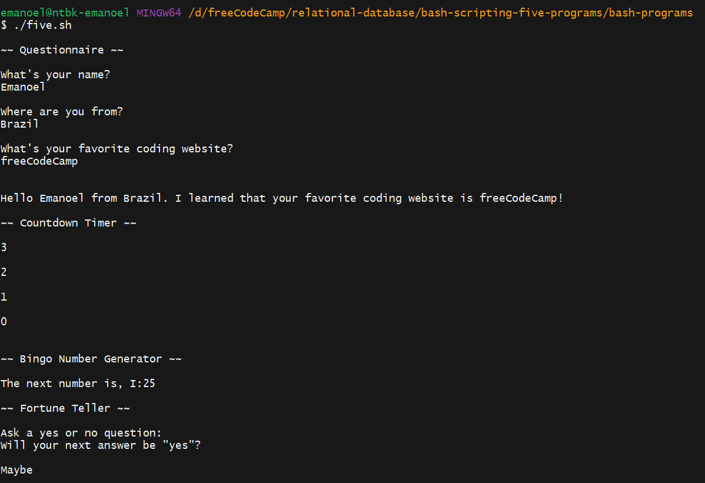

# Five Program Runner

This is a `script` that runs all the other four programs (`questionnaire.sh`, `countdown.sh`, `bingo.sh`, `fortune.sh`) consecutively. It's a convenient tool for those who want to experience all the functionalities of the other scripts in one go.

## How to use

1. Run the `script`.
2. Follow the prompts and instructions provided by each of the four scripts that are run consecutively.

## Requirements

- Bash 4.0 or higher