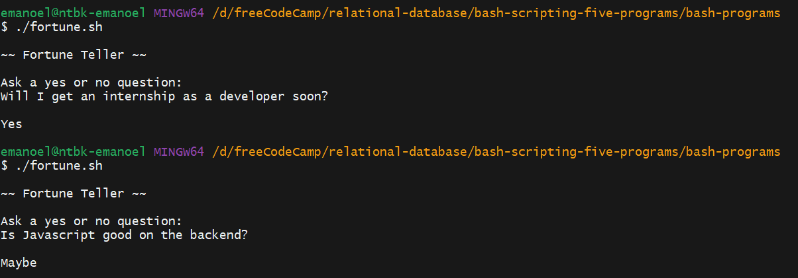

# Fortune Teller

This is a `script` that simulates a fortune-telling functionality. It prompts the user to ask a yes or no question and provides a random response from a predefined set of answers. It's a fun tool for those moments when you need a little guidance or just want to have a bit of fun.

## How to use

1. Run the `script`.
2. When prompted, enter a yes or no question.
3. The `script` will provide a random response from a predefined set of answers.

## Requirements

- Bash 4.0 or higher