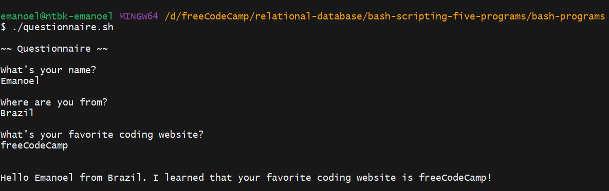

# Questionnaire

This is a `script` that facilitates a simple questionnaire functionality. It prompts the user with three questions and prints the responses. It's a useful tool for gathering quick and simple data from users.

## How to use

1. Run the `script`.
2. When prompted, answer the three questions.
3. The `script` will print your responses.

## Requirements

- Bash 4.0 or higher